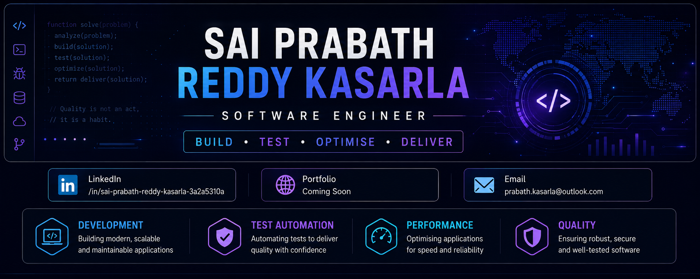

  

# Hi, I'm Sai Prabath Reddy Kasarla 👋

### Software Engineer | Software Development | Test Automation | Quality Engineering

I am a **Software Engineer** passionate about building reliable, scalable, maintainable, and user-focused software.

My experience spans **software development, test automation, application testing, databases, performance optimisation, and production support**.

> **Build • Test • Optimise • Deliver**

---

## 👨‍💻 About Me

- 💻 Software Engineer with experience across development and testing
- 🏗️ Building modern full-stack applications with **React, Next.js and TypeScript**
- 🧪 Experienced in **UI, API, E2E, mobile and desktop test automation**
- 🗄️ Working with **PostgreSQL, Prisma and database-driven applications**
- ⚡ Interested in application performance, scalability and optimisation
- 🔐 Focused on reliable, maintainable and well-tested software
- ☁️ Microsoft Azure Fundamentals certified
- 🧪 ISTQB Foundation Level certified
- 📚 Always learning and exploring new technologies

---

## 💻 Software Development

- Full-Stack Web Development
- Frontend & Backend Development
- REST API Development
- Database Design
- Application Development
- Responsive UI Development
- Performance Optimisation
- Production Support
- Git-based Development Workflows

---

## 🧪 Testing & Quality Engineering

- End-to-End Test Automation
- UI Automation Testing
- API Testing
- Mobile Application Testing
- Desktop Application Testing
- Cross-Browser Testing
- Cross-Platform Testing
- Functional & Regression Testing
- Test Framework Development
- Test Case Design & Execution
- Defect Investigation & Reporting

---

## 🛠️ Tech Stack

### Languages

  

### Frontend

  

### Backend & Databases

  

**Also:** Prisma ORM • REST APIs • SQL

### Testing & Automation

  

**Playwright • Selenium • Appium • WinAppDriver • BrowserStack • Postman • E2E Testing • API Testing**

### Cloud, DevOps & Tools

  

---

## 🧪 Testing Toolkit

| Area | Technologies |
|---|---|
| Web Automation | Playwright, Selenium |
| Mobile Automation | Appium |
| Desktop Automation | WinAppDriver |
| API Testing | Postman |
| Cross-Browser / Device Testing | BrowserStack |
| Testing Approaches | E2E, Functional, Regression, UI, API |

---

## 🎓 Certifications

### ☁️ Microsoft Certified: Azure Fundamentals (AZ-900)

Foundational knowledge of cloud concepts, Azure services, Azure architecture, security, governance and management.

### 🧪 ISTQB Certified Tester - Foundation Level

Software testing fundamentals, test design techniques, test management, defect management and testing throughout the software development lifecycle.

---

## 📊 GitHub Activity

  
  

  

---

## 🟩 Contribution Activity

  

---

## 🎯 Engineering Interests

- Full-Stack Development
- Backend & APIs
- Database Design
- Test Automation
- Quality Engineering
- Performance Optimisation
- Cloud Technologies
- DevOps & Deployment

---

## 🌱 Currently Exploring

- Advanced Software Architecture
- Scalable Web Applications
- Cloud Engineering
- CI/CD
- Performance Engineering
- Advanced Test Automation
- Software Quality Engineering

---

## 🤝 Connect With Me

---

  <strong>Build • Test • Optimise • Deliver</strong>

  Thanks for visiting my GitHub profile! 👋

